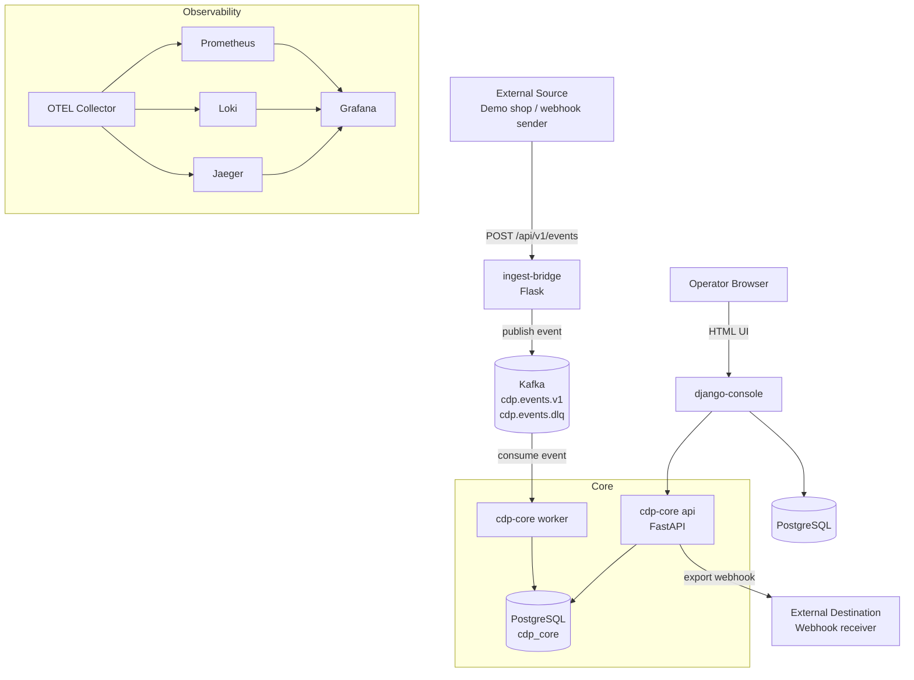

# Customer Data Platform MVP

Мы взяли Тему 4 `Customer Data Platform (CDP)` для e-commerce

Изначально ТЗ описывает корпоративную платформу клиентских данных со сбором и приемом событий, сопоставлением и объединением клиентских профилей, формированием единого профиля клиента `Customer 360`, сегментацией, активацией сегментов и высокой доступностью.
Для учебного проекта мы решили сократить объем до реалистичного MVP, который можно сделать за 3 двухнедельных спринта

## Почему проект разделен на 3 сервиса

Мы сознательно разделили систему на 3 сервиса, чтобы:
- пощупать каждый из фреймворков: `Django`, `Flask`, `FastAPI`
- не смешивать разные зоны ответственности в одном приложении
- потрогать событийно-ориентированную архитектуру через `Kafka`
- добавить базовую observability через `OpenTelemetry`

## Какие сервисы у нас есть

### `ingest-bridge` (`Flask`)
- принимает внешние webhook и HTTP-события
- валидирует источник
- нормализует полезную нагрузку
- публикует события в `Kafka`

### `cdp-core` (`FastAPI`)
- основной сервис системы
- читает события из `Kafka`
- выполняет объединение клиентских идентичностей
- обновляет `Customer 360 Lite`
- пересчитывает сегменты
- отдает API для профилей, сегментов и заданий на экспорт

### `django-console` (`Django`)
- внутренний кабинет для операторов
- показывает данные из `cdp-core`
- запускает export
- хранит локальный аудит действий оператора

## Что мы добавили специально для обучения

### `Kafka`
Мы добавили `Kafka`, чтобы:
- потрогать событийно-ориентированную архитектуру
- разделить прием и обработку событий
- показать асинхронную обработку событий
- использовать основную тему Kafka и `DLQ`

### Observability 
Мы добавили стек `Observability`, чтобы:
- видеть трассировку запросов и обработки событий
- собирать метрики
- собирать логи
- понимать, как сервисы взаимодействуют между собой

Стек:
- `OpenTelemetry Collector`
- `Prometheus`
- `Grafana`
- `Jaeger`
- `Loki`

## Что мы сократили относительно исходного ТЗ

Для MVP мы убрали или отложили:
- `Flink`
- `Spark`
- `Cassandra`
- `Elasticsearch`
- `Redis Cluster`
- вероятностное объединение пользователей
- машинное обучение и продвинутую аналитику
- развертывание в нескольких регионах
- отказоустойчивость и аварийное восстановление корпоративного уровня
- большое количество внешних интеграций
- сложный слой активации с множеством каналов

Вместо этого в MVP оставили только самое важное:
- прием одного основного потока событий
- детерминированное объединение пользователей
- `Customer 360 Lite`
- сегменты на правилах
- один простой сценарий экспорта

## Что такое `Customer 360 Lite`

Это упрощенный единый профиль клиента, в котором хранятся:
- идентификаторы (`email`, `phone`, `external_user_id`)
- базовые временные отметки
- агрегаты поведения
- агрегаты покупок
- текущие сегменты
- последние события

Этого достаточно, чтобы показать основную ценность CDP в рамках MVP

## Текущая архитектура

